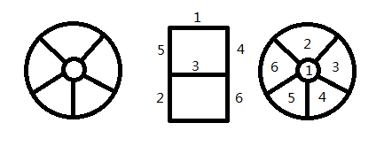
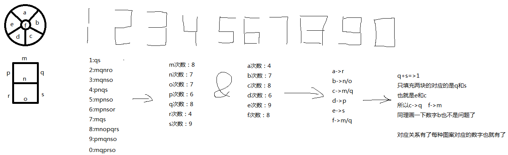

## 题目名称
家用电器上的图案

## 题目描述
这种图案曾经出现在一种电子设备上，不过我猜很少会有人像我一样吃饱撑得研究这种编码方式

## 出题/解题思路


10进制转字符串

=========================================================================

后发现不同手表的对应关系不一样，下面补上猜测方法



或者似乎也可以直接爆破？

## flag

```
ctfshow{dzbiao}
```
